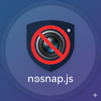

# nosnap.js [](https://badge.fury.io/js/nosnap.js) [](https://www.npmjs.com/package/nosnap.js) [](https://www.jsdelivr.com/package/npm/nosnap.js)

<div align="center">
  
</div>

A JavaScript library for creating animated noise text effects on HTML5 canvas. Transform your text into dynamic, animated noise patterns with smooth transitions and responsive behavior.

[Animated Noise Text Demo](https://apoorv.pro/nosnap.js/examples/)

## Features

- 🎨 **Dynamic Text Animation** - Smooth animated noise effects on text
- 📱 **Responsive Design** - Automatically adapts to canvas size changes
- ⚡ **High Performance** - Optimized rendering with configurable quality settings
- 🎛️ **Flexible Configuration** - Extensive customization options
- 🔧 **Framework Agnostic** - Works with React, Vue, Angular, or vanilla JavaScript
- 📦 **Multiple Module Formats** - ES6, CommonJS, and UMD builds
- 🛡️ **TypeScript Support** - Full type definitions included
- 🎯 **Error Handling** - Comprehensive error handling and recovery

## Installation

### NPM

```bash
npm install nosnap.js
```

### CDN

```html
<!-- ES Module -->
<script type="module">
  import NoSnap from 'https://cdn.jsdelivr.net/npm/nosnap.js/dist/nosnap.esm.js';
</script>

<!-- UMD (Global) -->
<script src="https://cdn.jsdelivr.net/npm/nosnap.js/dist/nosnap.umd.min.js"></script>
```

## Quick Start

```javascript
import NoSnap from 'nosnap.js';

// Get your canvas element
const canvas = document.getElementById('myCanvas');

// Create the animation
const animation = new NoSnap(canvas, {
  text: 'HELLO WORLD',
  cellSize: 2,
  stepMs: 32
});

// Start the animation
animation.start();
```

## Examples

### Basic Usage

```javascript
const animation = new NoSnap(canvas, {
  text: 'BASIC EXAMPLE'
});
animation.start();
```

### Custom Configuration

```javascript
const animation = new NoSnap(canvas, {
  text: 'CUSTOM STYLE',
  cellSize: 3,
  stepMs: 40,
  fontSize: 48,
  fontWeight: 'bold',
  fontFamily: 'Arial, sans-serif'
});
```

### Dynamic Text Updates

```javascript
// Change text without stopping animation
animation.setText('NEW TEXT');

// Update configuration
animation.updateConfig({
  cellSize: 4,
  stepMs: 50
});
```

### Responsive Design

```javascript
// The library automatically handles canvas resizing
window.addEventListener('resize', () => {
  // Canvas size changes are automatically detected
  // No manual intervention required
});
```

## Framework Integration

### React

```jsx
import { useEffect, useRef } from 'react';
import NoSnap from 'nosnap.js';

function AnimatedText({ text = 'REACT EXAMPLE' }) {
  const canvasRef = useRef(null);
  const animationRef = useRef(null);

  useEffect(() => {
    if (canvasRef.current) {
      animationRef.current = new NoSnap(canvasRef.current, {
        text,
        cellSize: 2,
        stepMs: 32
      });
      
      animationRef.current.start();
    }

    return () => {
      if (animationRef.current) {
        animationRef.current.destroy();
      }
    };
  }, []);

  useEffect(() => {
    if (animationRef.current) {
      animationRef.current.setText(text);
    }
  }, [text]);

  return <canvas ref={canvasRef} width={800} height={400} />;
}
```

### Vue.js

```vue
<template>
  <canvas ref="canvasRef" width="800" height="400"></canvas>
</template>

<script>
import { ref, onMounted, onUnmounted, watch } from 'vue';
import NoSnap from 'nosnap.js';

export default {
  props: {
    text: { type: String, default: 'VUE EXAMPLE' }
  },
  setup(props) {
    const canvasRef = ref(null);
    let animation = null;

    onMounted(() => {
      animation = new NoSnap(canvasRef.value, {
        text: props.text,
        cellSize: 2,
        stepMs: 32
      });
      animation.start();
    });

    onUnmounted(() => {
      if (animation) {
        animation.destroy();
      }
    });

    watch(() => props.text, (newText) => {
      if (animation) {
        animation.setText(newText);
      }
    });

    return { canvasRef };
  }
};
</script>
```

## API Reference

### Constructor

```javascript
new NoSnap(canvas, options)
```

**Parameters:**
- `canvas` (HTMLCanvasElement) - **Required.** Target canvas element
- `options` (Object) - **Optional.** Configuration options

### Methods

| Method | Description |
|--------|-------------|
| `start()` | Start the animation |
| `stop()` | Stop the animation |
| `destroy()` | Stop animation and clean up all resources |
| `setText(text)` | Update the displayed text dynamically |
| `updateConfig(options)` | Update configuration options |

### Configuration Options

| Option | Type | Default | Description |
|--------|------|---------|-------------|
| `text` | string | `'HELLO'` | Text to display |
| `cellSize` | number | `2` | Size of noise cells (1-10) |
| `circleRadius` | number | `300` | Radius of animated circle effect |
| `stepPixels` | number | `4` | Pixels to move per animation step |
| `stepMs` | number | `32` | Animation step interval (ms) |
| `maskBlockSize` | number | `2` | Text mask block size |
| `fontSize` | number | `null` | Font size (auto-calculated if null) |
| `fontWeight` | number\|string | `900` | Font weight |
| `fontFamily` | string | `'sans-serif'` | Font family |

## Performance Optimization

### Mobile-Friendly Settings

```javascript
const mobileAnimation = new NoSnap(canvas, {
  text: 'MOBILE',
  cellSize: 4,        // Larger cells = better performance
  stepMs: 50,         // Slower updates = less CPU usage
  maskBlockSize: 4    // Larger blocks = faster rendering
});
```

### High-Quality Settings

```javascript
const qualityAnimation = new NoSnap(canvas, {
  text: 'QUALITY',
  cellSize: 1,        // Fine detail
  stepMs: 16,         // 60fps animation
  maskBlockSize: 1    // Sharp text edges
});
```

## Browser Compatibility

- Chrome 60+
- Firefox 55+
- Safari 12+
- Edge 79+

**Required Features:**
- HTML5 Canvas 2D API
- ES6 Modules (for module builds)
- requestAnimationFrame
- ResizeObserver (with polyfill fallback)

## Documentation

- [📖 Complete API Documentation](docs/API.md)
- [🎯 Usage Guide & Examples](docs/USAGE_GUIDE.md)
- [⚛️ React Integration Examples](examples/frameworks/react-example.jsx)
- [🟢 Vue.js Integration Examples](examples/frameworks/vue-example.vue)
- [🌐 Vanilla JavaScript Examples](examples/frameworks/vanilla-js-example.html)

## Examples & Demos

- [📋 Examples Index](examples/) - Browse all available examples
- [🚀 Local Development Example](examples/local-dev-example.html) - Interactive demo with controls
- [📦 Module Usage Examples](examples/module-usage-examples.md) - Different module systems
- [⚛️ Framework Integration Examples](examples/frameworks/) - React, Vue, etc.

## Development

```bash
# Install dependencies
npm install

# Build the library
npm run build

# Run tests
npm test

# Watch mode for development
npm run build:watch

# Start development server for examples
npm run dev

# Or just serve files (after building)
npm run serve
```

### Local Development Server

The project includes a development server to easily test examples locally:

```bash
# Build and start server
npm run dev
```

This will:
1. Build the library in development mode
2. Start a local HTTP server on `http://localhost:3000`
3. Enable CORS for cross-origin requests
4. Disable caching for development

You can then access examples at:
- `http://localhost:3000/examples/`
- `http://localhost:3000/docs/`

### Example Usage in Development

Create an HTML file in the `examples/` directory:

```html
<!DOCTYPE html>
<html>
<head>
  <title>NoSnap.js Local Example</title>
</head>
<body>
  <canvas id="canvas" width="800" height="400"></canvas>
  
  <!-- Use local build -->
  <script src="../dist/nosnap.umd.js"></script>
  <script>
    const canvas = document.getElementById('canvas');
    const animation = new NoSnap(canvas, {
      text: 'LOCAL DEV',
      cellSize: 2
    });
    animation.start();
  </script>
</body>
</html>
```

## Contributing

1. Fork the repository
2. Create your feature branch (`git checkout -b feature/amazing-feature`)
3. Commit your changes (`git commit -m 'Add some amazing feature'`)
4. Push to the branch (`git push origin feature/amazing-feature`)
5. Open a Pull Request

## Credits

Hacker News [submission](https://news.ycombinator.com/item?id=45284311)

## License

MIT License - see the [LICENSE](LICENSE) file for details.

## Support

- 📧 [Report Issues](https://github.com/your-repo/animated-noise-text/issues)
- 💬 [Discussions](https://github.com/your-repo/animated-noise-text/discussions)
- 📚 [Documentation](docs/)

---

Made with ❤️ for the web development community